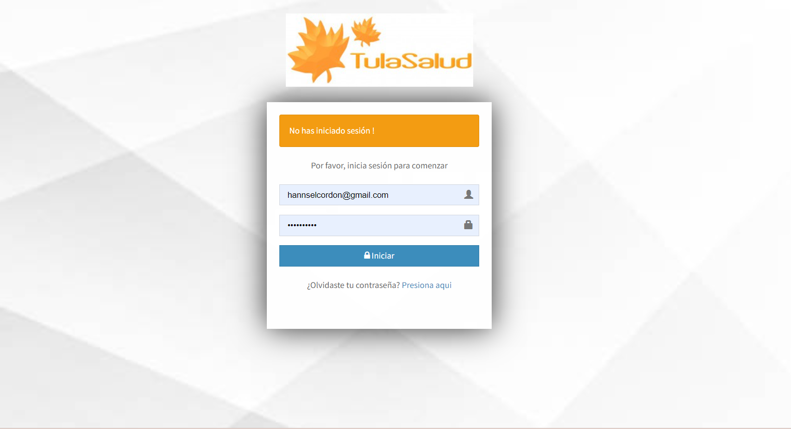
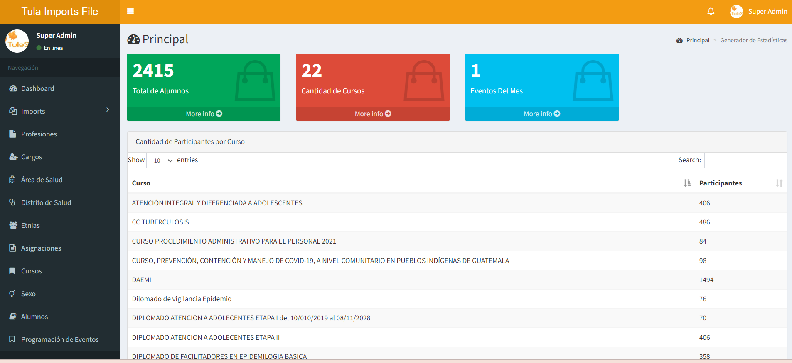
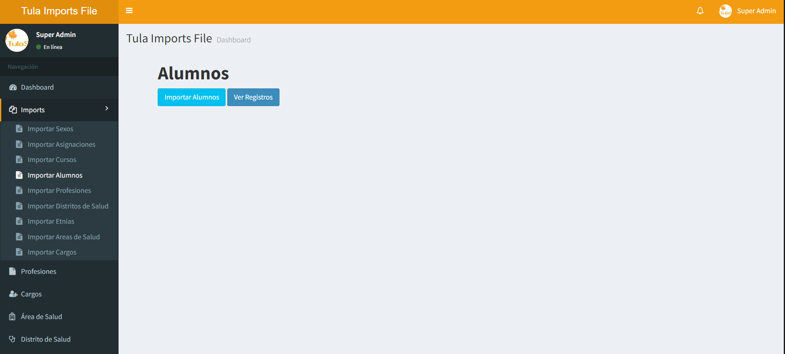
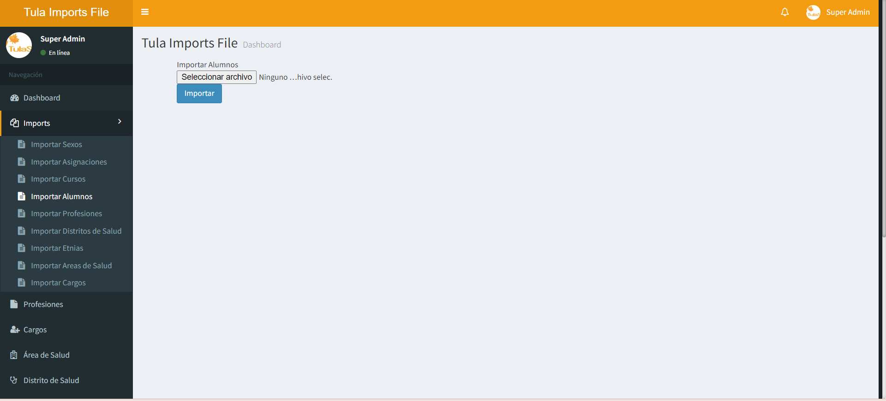
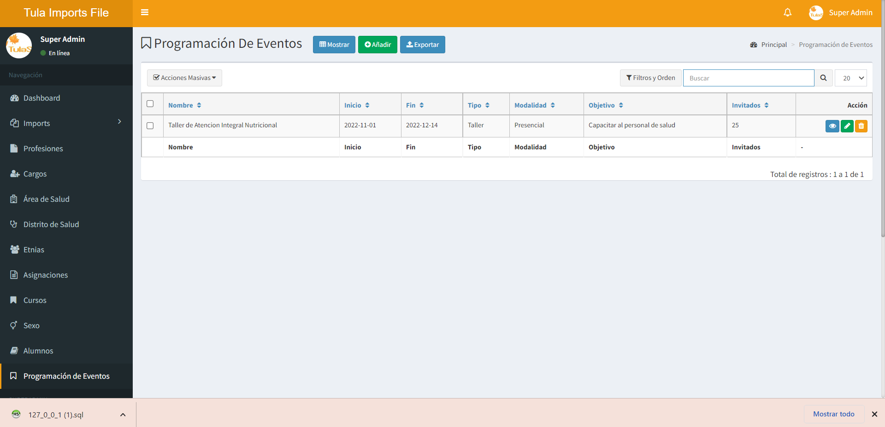
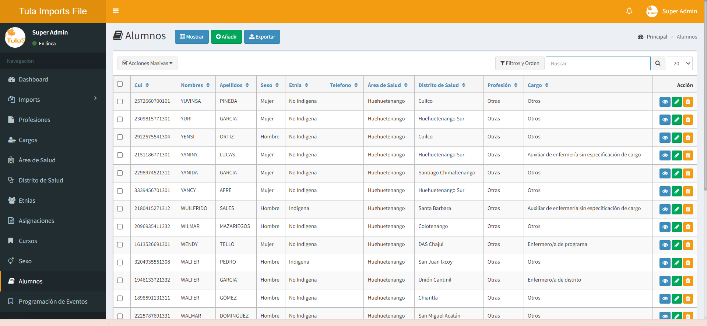

## Acerca de Laravel

Laravel es un marco de aplicación web con una sintaxis expresiva y elegante. Creemos que el desarrollo debe ser una experiencia placentera y creativa para ser realmente satisfactorio. Laravel elimina el dolor del desarrollo al facilitar las tareas comunes utilizadas en muchos proyectos web, como:

- [Simple, fast routing engine](https://laravel.com/docs/routing).
- [Powerful dependency injection container](https://laravel.com/docs/container).
- Multiple back-ends for [session](https://laravel.com/docs/session) and [cache](https://laravel.com/docs/cache) storage.
- Expressive, intuitive [database ORM](https://laravel.com/docs/eloquent).
- Database agnostic [schema migrations](https://laravel.com/docs/migrations).
- [Robust background job processing](https://laravel.com/docs/queues).
- [Real-time event broadcasting](https://laravel.com/docs/broadcasting).

Laravel es accesible, potente y proporciona las herramientas necesarias para aplicaciones grandes y robustas.

## Acerca de Imports

Proyecto realizado para el curso de Aseguramiento de la Calidad

## Instalacion de Imports via Host

se deben clonar todos los elementos dentro de la carpeta del host teniendo en cuenta que la pagina principal o index se encuentra dentro de la carpeta public por lo que se debe enrutar la carpeta public, asi como brindarle permisos a la carpeta Storage y por ultimo existe un archivo oculto con extension .env se debe de modificar la conexion de la base de datos definiendo el servidor remoto del host el mismo que indica el proveedor asi como el nombre de la base de datos, el usuario y contraseña que este paso se realizaria en las primeras configuraciones del host asi como agregar las tablas de la base de datos proporcionado en este repositorio.

## Para Modificar el proyecto 

- Instalar Composer en el sistema
- Instalar Node Js
- Instalar todas las extensiones de PHP 7.4 para Laravel 8
- Alternativa mas rapida utilizar Xampp o Lampp con PHP 7.4
- Motor de Base de datos Mysql, Postgresql, etc. lo unico en tomar en cuenta es que dependiendo al motor de base de datos es el motor que se debe seleccionar en el archivo .env de Laravel
- Instalar Visual Code

## Al tener instalado todas las dependencias anteriores se procede a instalar de la siguiente manera:
- **git clone https://gitlab.com/hcordona/sqahutula.git dentro de la carpeta htdocs de Xampp si se esta utilizando xampp si no dentro de la carpeta del servidor que podria ser www/html/**
- **EJecutar terminal o CMD y colocar: cd sqahutula**
- **Ejecutar Terminal o CMD y colocar: Code .**
- **Luego de abrir Visual Code abrir una terminal y ejecutar:**
- **composer install**
- **composer dump-autoload**
- **npm install**
- **npm run dev**
- **En el repositorio se ha cargado el archivo .env para la configuracion de la base de datos y correo electronico, en el caso de no poseerlo se debe de proceder a realizar lo siguiente:**
- **cp .env.example .env**
- **php artisan key:generate**

### Socios Premium Larvel

- **[Vehikl](https://vehikl.com/)**
- **[Tighten Co.](https://tighten.co)**
- **[Kirschbaum Development Group](https://kirschbaumdevelopment.com)**
- **[64 Robots](https://64robots.com)**
- **[Cubet Techno Labs](https://cubettech.com)**
- **[Cyber-Duck](https://cyber-duck.co.uk)**
- **[Many](https://www.many.co.uk)**
- **[Webdock, Fast VPS Hosting](https://www.webdock.io/en)**
- **[DevSquad](https://devsquad.com)**
- **[Curotec](https://www.curotec.com/services/technologies/laravel/)**
- **[OP.GG](https://op.gg)**
- **[WebReinvent](https://webreinvent.com/?utm_source=laravel&utm_medium=github&utm_campaign=patreon-sponsors)**
- **[Lendio](https://lendio.com)**

## Licencia

El marco de Laravel es un software de código abierto con licencia bajo la [licencia MIT](https://opensource.org/licenses/MIT).
